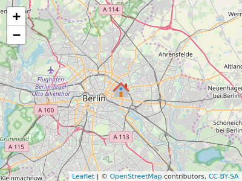
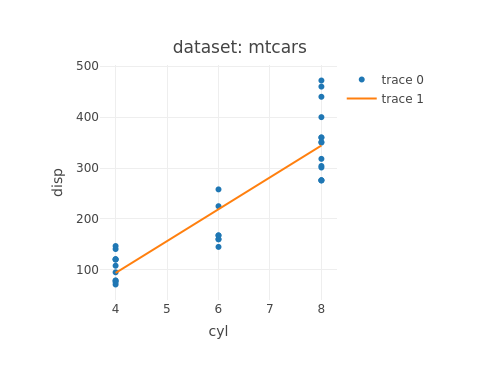

## What is "The Data Explorer"
I need to plot those variables and these variables and i need to calculate the linear regression and get the r² value ...  
I wish there were a tool for that ...
THERE IS!

"The Data Explorer"

The Data Explorer you can find here:
[The Data Explorer - Shiny App](https://github.com/simjbaum/StatisticInferenceAssignment1)  

--- .class #id 

## Hi my name is Simon

I live here:  

  
and I developed the "Data Explorer"  ... but its a fairly simple tool

--- .class #id  

## what does the data explorer do?  

You can choose between the datasets:

> 1. mtcars
> 2. airquality
> 3. iris

>  then you can choose between variables of the dataset to be plotted to each other and the regression line will be added in a plotly plot, for example like this:
>   

  

--- .class #id 
## Good Bye 

